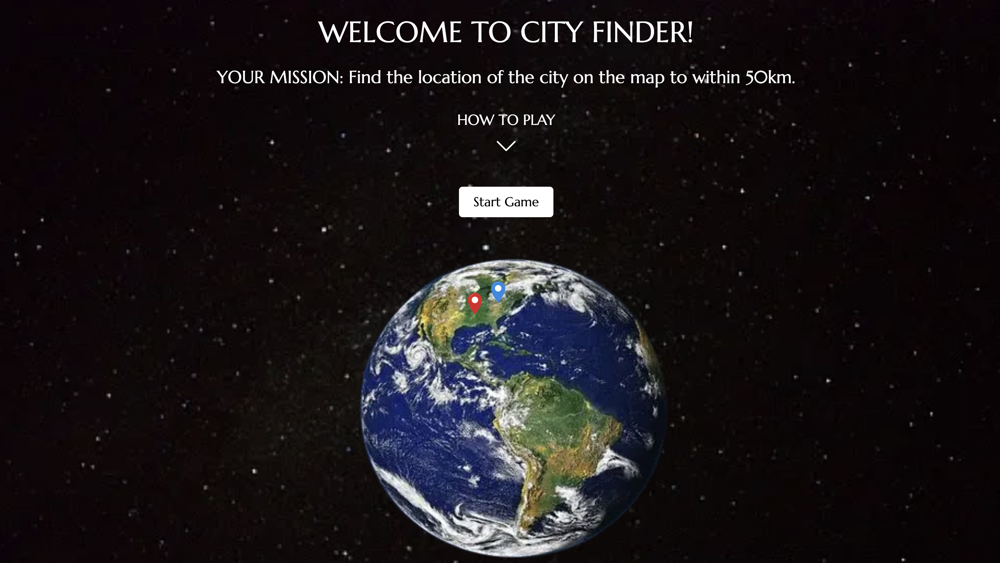

# City-Finder
An exercise to build a game where the user tries to locate a city on a label free map to within 50km.

website is deployed at https://cityfinder.netlify.app

# Requirements
1 . The user will see a map of Europe without Streets + Cities (Only Country X borders). The
objective is to find the right location of the city on this map. After placing the needle pin,
the game will show the user the right location of the city and the difference between the user selection and the correct location in kilometers. If the user selection is within 50km of the city, the selection will be defined as 'location found'.

2 . In the beginning, the player has a total of 1500 that symbolizes kilometers. At each round the difference between the position of the city and the needle pin, if over 50km, will reduce the total by the same amount.

3 . The game ends when no kilometers are left or if the end has been reached. The final score is the amount of cities the user has found.

# Technologies
Typescript •
Next JS •
React • 
Bootstrap • 
Leaflet • 
Node JS

# Getting Started
Clone this repository then run the following commands: 
  - npm install
  - npm run dev
  - application running at http://localhost:3000

# Further enhancements
 - more cities to be added and selected at random.
 - svg icons to replace html in Marker component.
 - timer to be introduced and capture who completes the round in the quickest time.
 - backend could be implemented to allow scores/time to be recorded (e.g. mongoDB).
 - leaderboard could be added as an additonal page.

# Author
<h3>Robert Bish</h3>

